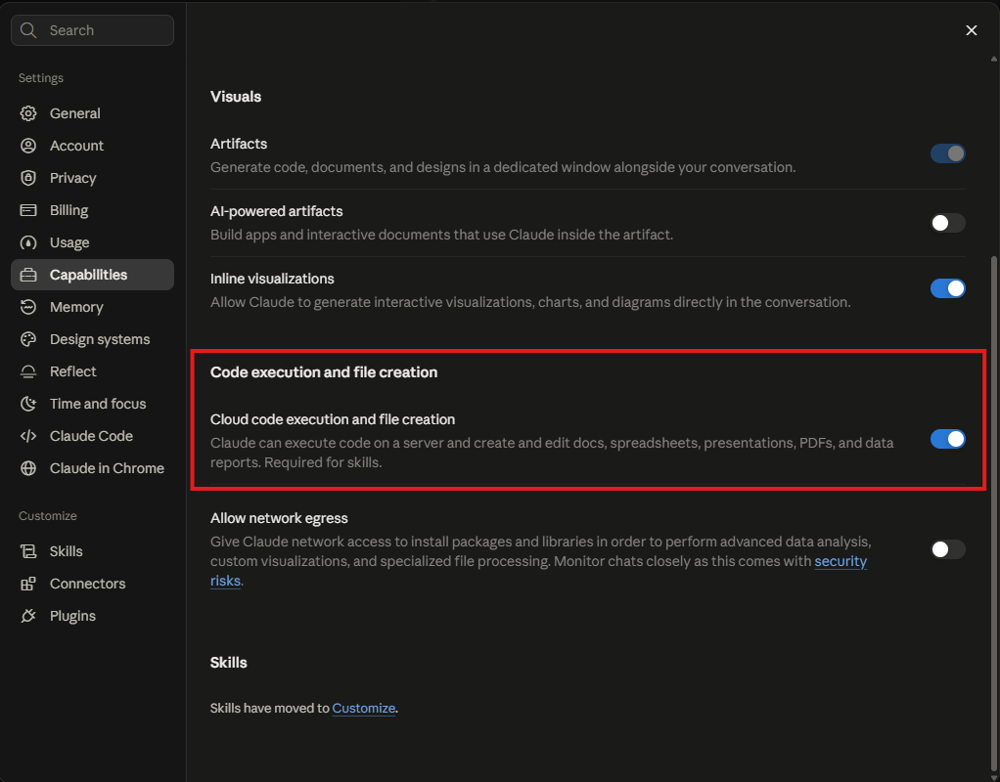
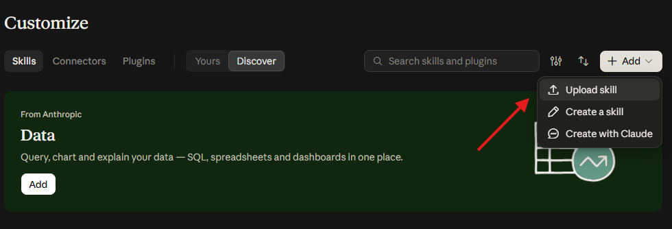
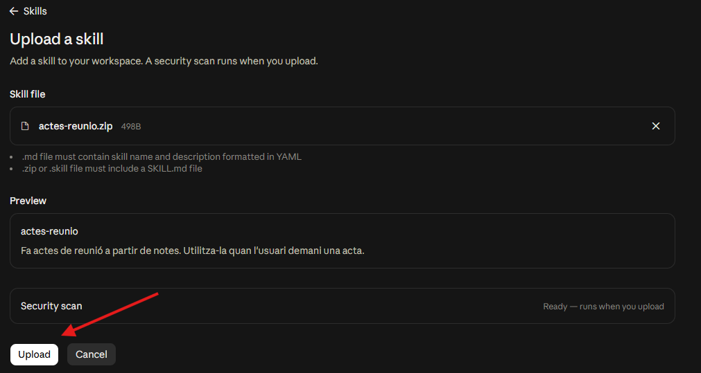
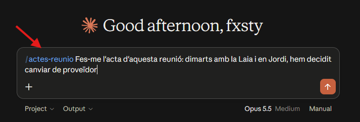
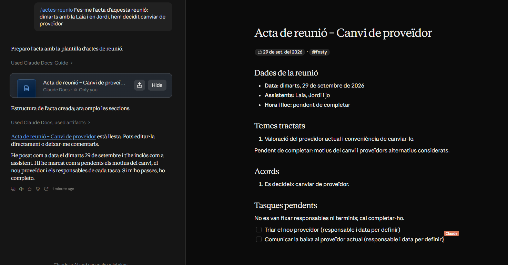

# Fitxa tècnica: Creació d'una skill de Claude

## Objectiu

Crear una skill personalitzada per Claude, que són unes instruccions que Claude fa servir automàticament quan li demanes una tasca concreta.

## Materials necessaris

- Compte d'Anthropic per accedir a claude.ai (pla Pro o superior)
- Un editor de text
- Programa per fer ZIP

## Procediment

1. Activar l'execució de codi a Configuració.

   
2. Crear una carpeta amb el nom de la skill, per exemple `actes-reunio`.
3. Dins la carpeta, crear un fitxer `SKILL.md` amb això:

   ```markdown
   ---
   name: actes-reunio
   description: Fa actes de reunió a partir de notes. Utilitza-la quan l'usuari demani una acta.
   ---

   # Actes de reunió

   Fes l'acta amb: data, assistents, temes tractats, acords i tasques pendents.
   ```

4. Comprimir la carpeta en ZIP.
5. Anar a Configuració → Skills i pujar el ZIP.

   

   
6. Activar la skill i provar-la en un xat nou.

   

   

## Comprovacions

- [ ] L'execució de codi està activada
- [ ] El fitxer es diu `SKILL.md`
- [ ] El `name` és igual que el nom de la carpeta
- [ ] La skill surt a la llista i està activada
- [ ] Claude la fa servir quan li demano una acta

## Incidències i solucions

| Incidència | Solució |
|---         |---      |
| No surt l'opció de Skills | Activar l'execució de codi o revisar el pla |
| Error en pujar el ZIP | Comprimir la carpeta sencera, no només el fitxer |
| Claude no fa servir la skill | Millorar la `description` |

## Recursos

- [Documentació de skills de Claude](https://claude.com/docs/skills/how-to)